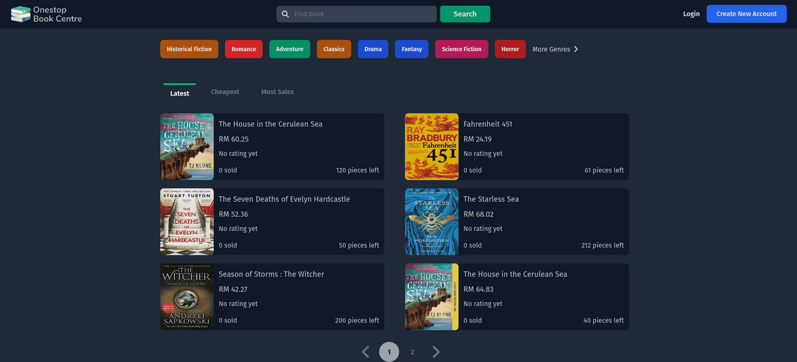

# Onestop Book Centre
For my degree's graduation, I was required to build a web application that used 3-tier architecture or above. Thus, I decided to create this website. 

---

## Stack
It is created using those amazing technologies:
- [Laravel](https://laravel.com/)
- [Tailwind](https://tailwindcss.com/)
- [Alpine](https://alpinejs.dev/)
- And many others!

---

## License
>You can check out the full license [here](https://github.com/hafizhaziq307/Onestop-Book-Centre/blob/main/LICENSE)

This project is licensed under the terms of the **MIT** license.

